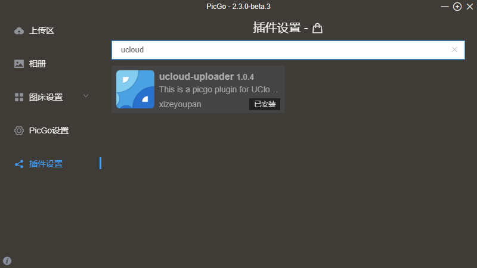

## picgo-plugin-UCloud-uploader

This repository is a PicGo plugin for uploading images to ucloud.

## How to use
1. 对于CLI命令行，安装：`picgo install ucloud-uploader`，卸载：`picgo uninstall ucloud-uploader`。配置：`picgo set uploader`后选择`UCloud-uploader`并填写参数，默认保存在[默认配置文件](https://picgo.github.io/PicGo-Core-Doc/zh/guide/config.html#%E9%BB%98%E8%AE%A4%E9%85%8D%E7%BD%AE%E6%96%87%E4%BB%B6)中，可修改。   
2. 对于图形界面，可直接搜索，并在图床设置中设置。

| Param | Type | Description |
| --- | --- | --- |
| publicKey | 必需 | api公钥 获取方式：[这里](https://console.ucloud.cn/uapi/apikey)|
| privateKey | 必需 | api私钥 |
| bucket | 必需 | 存储空间名 |
| domain | 必需 | 存储空间域名，紧跟在`bucket`后面的东西，**包括点**，例如`.cn-sh2.ufileos.com` |
| prefix | 不填为主目录 | 要存储的路径 |
| cdnDomain | 可选 | 自定义域名，包括协议头 |
